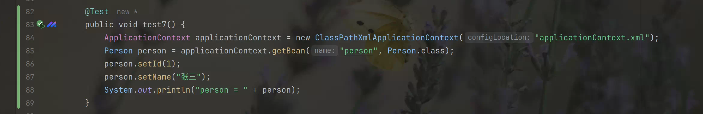

# spring

## 1. 工厂设计模式

```java
public interface UserService {
    void register(User user);

    void login(String username, String password);
}

public class UserServiceImpl implements UserService {

    private UserDao userDao = new UserDaoImpl();

    @Override
    public void register(User user) {
        userDao.save(user);
    }

    @Override
    public void login(String username, String password) {
        userDao.findByNameAndPassword(username, password);
    }
}
```

```java
public interface UserDao {
    void save(User user);

    void findByNameAndPassword(String name, String password);
}

public class UserDaoImpl implements UserDao {
    @Override
    public void save(User user) {
        System.out.println("insert into user = " + user);
    }

    @Override
    public void findByNameAndPassword(String name, String password) {
        System.out.println("select * from user where name = " + name + " and password = " + password);
    }
}
```

```java
public class User {
    private String name;
    private String password;

  	//...
}
```

```java
@Test
    public void test1() {
        UserService userService = new UserServiceImpl();
        // UserService userService = new NewUserServiceImpl();

        userService.register(new User("张三", "123456"));
        userService.login("张三", "123456");
    }
```

在这一版本代码中，测试类中`UserService userService = new UserServiceImpl();`存在代码耦合；在`private UserDao userDao = new UserDaoImpl();`存在代码耦合。


采用工厂类解决耦合：

```java
public static UserService getUserService() {
    return new UserServiceImpl();
} 
```

```java
@Test
public void test2() {
    // UserService userService = BeanFactory.getUserService();

    UserService userService = (UserService) BeanFactory.getBean("userService");

    userService.register(new User("张三", "123456"));
    userService.login("张三", "123456");
}
```

这样就解决了测试类中的耦合。但是工厂中又存在耦合了。


在resource根目录下新建`applicationContext.properties`文件，在工厂中读取配置文件，解决工厂中的字符串耦合。

```properties
userService=com.lb.basic.UserServiceImpl
userDao=com.lb.basic.UserDaoImpl
```

```java
private static Properties properties = new Properties();

    static {
        try {
     properties.load(BeanFactory.class.getClassLoader().getResourceAsStream("applicationContext.properties"));
        } catch (Exception e) {
            throw new RuntimeException(e);
        }
    }

public static UserService getUserService() {
    UserService userService = null;
    try {
        Class<?> aClass = Class.forName(properties.getProperty("userService"));
        userService = (UserService) aClass.newInstance();
    } catch (ClassNotFoundException | InstantiationException | IllegalAccessException e) {
        throw new RuntimeException(e);
    }
    return userService;
}

public static UserDao getUserDao() {
    UserDao userDao = null;
    try {
        Class<?> aClass = Class.forName(properties.getProperty("userDao"));
        userDao = (UserDao) aClass.newInstance();
    } catch (ClassNotFoundException | InstantiationException | IllegalAccessException e) {
        throw new RuntimeException(e);
    }
    return userDao;
} 
```

这样又发现重复代码太多，可以设计一个通用工厂：

```java
public static Object getBean(String beanName) {
    Object bean = null;
    try {
        Class<?> aClass = Class.forName(properties.getProperty(beanName));
        bean = aClass.newInstance();
    } catch (ClassNotFoundException | InstantiationException | IllegalAccessException e) {
        throw new RuntimeException(e);
    }
    return bean;
}
```

只是在使用时需要强转。


## 2. Spring核心API

### 2.1 ApplicationContext接口

```properties
ClassPathXmlApplicationContext   非web环境(main junit)

XmlWebApplicationContext	web环境
```


`ApplicationContext`是一个重量级资源，不会重复创建。一个应用只会创建一个工厂对象，并且它一定是线程安全的。


### 2.2 程序开发

1. 创建类型
2. 配置文件
3. 通过工厂类获取对象

```java
public class Person {
}

<bean id="person" class="com.lb.basic.Person"/>

@Test
public void test4() {
    ApplicationContext applicationContext = new ClassPathXmlApplicationContext("applicationContext.xml");
    Person person = applicationContext.getBean("person", Person.class);
    System.out.println("person = " + person);
}
```

### 2.3 Spring 工厂实现原理


## 3. 注入

什么是注入？通过Spring工厂及配置文件，为所创建的成员变量赋值。

为什么要注入？通过编码的方式为成员变量赋值，存在代码耦合。


### 3.1 如何进行注入？

1. 类的成员变量提供set get方法。

2. 配置Spring的配置文件。

   ```java
   <bean id="person2" name="p" class="com.lb.basic.Person">
       <property name="name" value="lb"/>
       <property name="id" value="18"/>
   </bean>
   ```

3. 注入的好处：解耦合。


### 3.2 注入的简易原理


Spring通过底层调用对象属性的set方法，完成对成员变量赋值。这种方式也称为set注入。


### 3.3 Set注入详解


### 3.4 构造注入


### 3.5 控制反转和依赖注入

什么是控制反转？

控制：对于成员变量赋值的控制权

反转控制：对于成员变量赋值的控制权，从代码中反转到Spring工厂和配置文件中完成。

底层实现：工厂设计模式


什么是依赖注入？

注入：通过Spring的工厂及其配置文件，为对象(bean, 组件)的成员变量赋值。

依赖注入：当一个类需要另外一个类时，就意味着依赖，一旦出现依赖，就可以把另一个类作为本类的成员变量，最终通过Spring的配置文件进行注入(赋值)。

好处：解耦合。


## 4. Spring创建复杂对象


### 4.1 Spring工厂创建复杂对象的三种方式

#### 4.1.1 FactoryBean接口


```xml
<bean id="connection" class="com.lb.factorybean.ConnectionFactoryBean"/>
```

如果class中指定的类型是FactoryBean接口的实现类，那么通过id值获取的是这个类所创建的复杂对象 Connection 。 


```java
public class ConnectionFactoryBean implements FactoryBean<Connection> {
    private String driverClassName;
    private String url;
    private String username;
    private String password;

    public String getDriverClassName() {
        return driverClassName;
    }

    public void setDriverClassName(String driverClassName) {
        this.driverClassName = driverClassName;
    }

    public String getUrl() {
        return url;
    }

    public void setUrl(String url) {
        this.url = url;
    }

    public String getUsername() {
        return username;
    }

    public void setUsername(String username) {
        this.username = username;
    }

    public String getPassword() {
        return password;
    }

    public void setPassword(String password) {
        this.password = password;
    }

    @Override
    public Connection getObject() throws Exception {
        Class.forName(driverClassName);
        return DriverManager.getConnection(url, username, password);
    }

    @Override
    public Class<?> getObjectType() {
        return Connection.class;
    }

    @Override
    public boolean isSingleton() {
        return false;
    }
}


<bean id="connection" class="com.lb.factorybean.ConnectionFactoryBean">
    <property name="driverClassName" value="com.mysql.cj.jdbc.Driver"/>
    <property name="url" value="jdbc:mysql://localhost:3306/mybatis_learn"/>
    <property name="username" value="root"/>
    <property name="password" value="mysql_1120"/>
</bean>
```


#### 4.1.2 FactoryBean实现的简易原理

接口回调

1. 为什么Spring规定FactoryBean接口，并且实现getObject()?
2. ctx.getBean("conn")获取的是复杂对象Connection，而非ConnectionFactoryBean。


Spring内部运行流程


### 4.2 实例工厂

### 4.3 静态工厂

### 4.4 总结


## 5. 对象生命周期

### 5.1 创建

`Spring`工厂什么时候创建对象？

- `scope = singleton`：`Spring`工厂创建的同时，创建对象。在这种情况下，如果需要在获取对象时再创建对象可以设置：`<bean lazy-init="true"`
- `scope = prototype`:在获取对象的同时创建对象。


### 5.2 初始化

 `Spring`在创建对象之后，调用对象的初始化方法，完成对象的初始化操作。

- `InitializingBean`接口

```java
@Override
public void afterPropertiesSet() throws Exception {
    根据自己的需求进行初始化
}
```

- 提供一个普通方法并在配置文件中配置。

```java
public void myInit() {
    
}

<bean id="product" class="xxx.Product" init-method=""/>
```

细节：

1. 如果二者同时存在：`InitializingBean` 先于 `myInit` 执行。

2. 注入先于初始化

### 5.3 销毁阶段

`Spring`什么时候销毁创建的对象？`applicationContext.close()`执行时。

- `DisposableBean`

  ```java
  @Override
  public void destroy() throws Exception {
      System.out.println("Product.destroy");
  }
  ```

- 提供一个普通方法并在配置文件中配置。

  ```java
  public void myDestroy() {
      System.out.println("Product.myDestroy");
  }
  <bean id="product" class="xxx.Product" destroy-method=""/>
  ```

  细节：

  1. 销毁操作仅仅适用于`scope="singleton"`


### 5.4 生命周期总结


### 5.5 后置处理Bean


程序员实现`BeanPostProcessor`规定接口中的方法：

```java
@Nullable
default Object postProcessBeforeInitialization(Object bean, String beanName) throws BeansException {
    return bean;
}
作用：Spring创建完对象并进行注入后可以运行before方法进行加工，
获得Spring创建好的对象：通过方法参数
最终通过返回值交给Spring框架
    

@Nullable
default Object postProcessAfterInitialization(Object bean, String beanName) throws BeansException {
	return bean;
}
作用：Spring执行初始化操作之后可以运行After方法加工
获得Spring创建好的对象：通过方法参数
最终通过返回值交给Spring框架
```

```java
public class Category {
    private Integer id;
    private String name;
	// set get
}

public class MyBeanPostPro implements BeanPostProcessor {

    @Override
    public Object postProcessBeforeInitialization(Object bean, String beanName) throws BeansException {
        return BeanPostProcessor.super.postProcessBeforeInitialization(bean, beanName);
    }

    @Override
    public Object postProcessAfterInitialization(Object bean, String beanName) throws BeansException {
        if (bean instanceof Category) {
            Category category = (Category) bean;
            category.setName("myBeanPostPro");
        }
        return bean;
    }
}

<bean id="category" class="com.lb.beanpost.Category">
    <property name="name" value="category"/>
    <property name="id" value="1"/>
</bean>

<bean id="myBeanPostPro" class="com.lb.beanpost.MyBeanPostPro"/>
```

## 6. 代理设计模式

### 6.1 静态代理


问题：静态代理类文件数量多


### 6.2 动态代理


细节：

- `Spring`创建的动态代理类在哪里？
  `Spring`框架在运行时，通过动态字节码技术，在JVM创建的，等程序结束后，会和JVM一起消失。
  什么是动态字节码技术：通过第三方动态字节码框架，在JVM中创建对应类的字节码，进而创建对象，当虚拟机结束，动态字节码跟着消失。
  
  
  动态代理无需类文件，避免了静态代理的弊端。
  
- 动态代理的编程简化代理的开发

  在额外功能不改变的前提下，创建其他目标类的代理对象，只需要指定原始目标对象即可，

- 动态代理额外功能维护性大大增强


### 6.3 额外功能详解

1. `MethodBeforeAdvice`

   只能执行在原始方法之前。

```java
public class Before implements MethodBeforeAdvice {
    /**
     * 在目标方法执行前执行的增强逻辑
     *
     * @param method 目标方法       boolean login(String name, String password)
     * @param args   目标方法的参数  String username, String password
     * @param target 目标对象       UserServiceImpl
     * @throws Throwable 如果在执行通知时发生异常
     */
    @Override
    public void before(Method method, Object[] args, Object target) throws Throwable {
        System.out.println("---Before.before Log---");
    }
}

各个参数按需使用
```

2. `MethodInterceptor`方法拦截器

   ```java
   public class Around implements MethodInterceptor {
       /**
        * 在目标方法执行前后执行的增强逻辑
        *
        * @param methodInvocation 方法调用对象，包含目标方法的信息
        * @return 目标方法的执行结果
        * @throws Throwable 如果在执行通知时发生异常
        */
       @Override
       public Object invoke(MethodInvocation methodInvocation) throws Throwable {
           System.out.println("---Around.before Log---");
           Object result = methodInvocation.proceed();
           System.out.println("---Around.after Log---");
           return result;
       }
   }
   ```

   ```java
   public class Around implements MethodInterceptor {
       @Override
       public Object invoke(MethodInvocation methodInvocation) throws Throwable {
           Object result = null;
           try {
               result = methodInvocation.proceed();
           } catch (Throwable throwable) {
               throwable.printStackTrace();
           }
           return result;
       }
   }
   原始方法抛出异常时执行
   ```

   

### 

在 Java 的 AOP（Aspect-Oriented Programming，面向切面编程）开发中，**切点表达式**用于定义在哪些连接点（Join Points）上应用通知（Advice）。连接点通常是方法的执行。切点表达式的作用是找到匹配的连接点，然后在这些连接点上执行对应的切面逻辑（如前置通知、后置通知等）。

### 6.4 切入点详解

1. **访问修饰符（可选）**：用于指定方法的访问修饰符，例如 `public`、`private` 等。如果不指定，则匹配所有修饰符。
   
2. **返回类型**：指定匹配方法的返回类型，通常使用 `*` 表示任意返回类型。

3. **包名**：指定方法所在的包名，可以是精确包名，也可以使用 `..` 来表示递归匹配子包。

4. **类名**：指定方法所属的类名。可以用 `*` 表示所有类。

5. **方法名**：指定要匹配的方法名。可以使用 `*` 表示任意方法。

6. **参数列表**：指定匹配方法的参数类型，可以使用具体类型或者通配符 `..` 表示任意参数。
[UserService.java](src/main/java/com/lb/proxy/dynamic/UserService.java)
#### 常见的切点表达式
1. **execution**：最常见的切点表达式，用于匹配方法执行。
   
   语法格式：`execution(修饰符 返回类型 包名.类名.方法名(参数))`

   示例：
   - `execution(public * com.example.service.UserService.*(..))`：匹配 `UserService` 类中所有公共方法，方法参数可以是任意类型。
   - `execution(* com.example..*.*(..))`：匹配 `com.example` 包及其子包中所有类的任意方法。

2. **within**：匹配某个类或包中的所有方法。

   语法格式：`within(包名.类名)`

   示例：
   - `within(com.example.service.UserService)`：匹配 `UserService` 类中的所有方法。
   - `within(com.example.service..*)`：匹配 `com.example.service` 包及其子包中的所有类的所有方法。

3. **this** 和 **target**：分别用于匹配代理对象和目标对象的类型。`this` 匹配的是代理对象，`target` 匹配的是目标对象。

   示例：
   - `this(com.example.service.UserService)`：匹配 `UserService` 类型的代理对象。
   - `target(com.example.service.UserService)`：匹配 `UserService` 类型的目标对象。

4. **args**：匹配方法参数的类型。

   语法格式：`args(参数类型)`

   示例：
   - `args(java.lang.String)`：匹配第一个参数为 `String` 类型的方法。
   - `args(java.lang.String, ..)`：匹配第一个参数为 `String`，后面可以有任意数量和类型参数的方法。

5. **@annotation**：匹配带有指定注解的方法。

   示例：
   - `@annotation(com.example.MyAnnotation)`：匹配标有 `MyAnnotation` 注解的方法。

6. **@within** 和 **@target**：用于匹配类上的注解。`@within` 用于匹配目标类具有某个注解，`@target` 用于匹配代理对象的目标类具有某个注解。

   示例：
   - `@within(com.example.MyClassAnnotation)`：匹配带有 `MyClassAnnotation` 注解的类中的所有方法。


## 7. AOP编程

### 7.1 动态代理类的创建


```java
public class TestJdkProxy {
    public static void main(String[] args) {
        // 创建一个 UserService 接口的实现类 UserServiceImpl 的实例
        UserService userService = new UserServiceImpl();

        // 创建一个 InvocationHandler 接口的实现类，用于处理代理对象的方法调用
        InvocationHandler handler = new InvocationHandler() {
            /**
             * 当代理对象的方法被调用时，会自动调用这个 invoke 方法。
             *
             * @param proxy 代理对象。
             * @param method 被调用的方法。
             * @param args 方法的参数。
             * @return 方法的返回值。
             * @throws Throwable 任何可能抛出的异常。
             */
            @Override
            public Object invoke(Object proxy, Method method, Object[] args) throws Throwable {
                // 在执行目标方法之前，输出一些信息
                System.out.println("执行目标方法之前");
                // 执行目标方法
                Object ret = method.invoke(userService, args);
                // 返回目标方法的执行结果
                return ret;
            }
        };

        // 使用 Proxy 类的 newProxyInstance 方法创建一个代理对象
        UserService newedProxyInstance = (UserService) Proxy.newProxyInstance(TestJdkProxy.class.getClassLoader(), userService.getClass().getInterfaces(), handler);

        // 调用代理对象的方法
        newedProxyInstance.register(new User("张三", "123456"));
        newedProxyInstance.login("张三", "123456");
    }
}
```

### 7.2 CGlib的动态代理


```java
public class TestCglib {
    public static void main(String[] args) {
        // 创建一个 UserService 接口的实现类 UserServiceImpl 的实例
        UserService userService = new UserService();

        // 创建一个 Enhancer 对象，用于生成代理类
        Enhancer enhancer = new Enhancer();

        // 设置 Enhancer 对象的类加载器
        enhancer.setClassLoader(TestCglib.class.getClassLoader());

        // 设置 Enhancer 对象的父类，即要代理的目标类
        enhancer.setSuperclass(UserService.class);

        // 创建一个 MethodInterceptor 接口的实现类，用于处理代理对象的方法调用
        MethodInterceptor interceptor = new MethodInterceptor() {
            /**
             * 当代理对象的方法被调用时，会自动调用这个 intercept 方法。
             *
             * @param obj 代理对象。
             * @param method 被调用的方法。
             * @param args 方法的参数。
             * @param proxy 方法的代理对象。
             * @return 方法的返回值。
             * @throws Throwable 任何可能抛出的异常。
             */
            @Override
            public Object intercept(Object obj, Method method, Object[] args, MethodProxy proxy) throws Throwable {
                // 在执行目标方法之前，输出一些信息
                System.out.println("执行目标方法之前");
                // 执行目标方法
                Object ret = method.invoke(userService, args);
                // 在执行目标方法之后，输出一些信息
                System.out.println("执行目标方法之后");
                // 返回目标方法的执行结果
                return ret;
            }
        };

        // 设置 Enhancer 对象的回调函数，即 MethodInterceptor 接口的实现类
        enhancer.setCallback(interceptor);

        // 使用 Enhancer 对象创建一个代理对象
        UserService newedProxyInstance = (UserService) enhancer.create();
        newedProxyInstance.register(new User("张三", "123456"));
        newedProxyInstance.login("张三", "123456");
    }
}
```


### 7.3 Spring工厂如何加工原始对象？


```java
public class ProxyBeanPostProcessor implements BeanPostProcessor {
    @Override
    public Object postProcessBeforeInitialization(Object bean, String beanName) throws BeansException {
        return bean;
    }

    /**
     * 在 bean 初始化之后执行的处理方法。
     * 该方法使用 JDK 动态代理为传入的 bean 创建一个代理对象，并在代理对象的方法调用前后输出一些信息。
     *
     * @param bean     被处理的 bean 对象。
     * @param beanName bean 的名称。
     * @return 返回创建的代理对象。
     * @throws BeansException 如果在处理过程中发生异常。
     */
    @Override
    public Object postProcessAfterInitialization(Object bean, String beanName) throws BeansException {
        // 创建一个 InvocationHandler 接口的实现类，用于处理代理对象的方法调用
        InvocationHandler invocationHandler = new InvocationHandler() {
            /**
             * 当代理对象的方法被调用时，会自动调用这个 invoke 方法。
             * 在这个方法中，我们在执行目标方法之前输出 "before"，执行目标方法之后输出 "after"。
             *
             * @param proxy 代理对象。
             * @param method 被调用的方法。
             * @param args 方法的参数。
             * @return 方法的返回值。
             * @throws Throwable 任何可能抛出的异常。
             */
            @Override
            public Object invoke(Object proxy, Method method, Object[] args) throws Throwable {
                System.out.println("before");
                // 执行目标方法
                Object invoke = method.invoke(bean, args);
                System.out.println("after");
                // 返回目标方法的执行结果
                return invoke;
            }
        };
        // 使用 Proxy 类的 newProxyInstance 方法创建一个代理对象
        return Proxy.newProxyInstance(ProxyBeanPostProcessor.class.getClassLoader(), bean.getClass().getInterfaces(), invocationHandler);
    }
}

<bean id="userService" class="com.lb.factory.UserServiceImpl"/>

<bean id="proxyBeanPostProcessor" class="com.lb.factory.ProxyBeanPostProcessor"/>
```

### 7.4 注解式AOP

1. 原始对象
2. 额外功能
3. 切入点
4. 组装切面

```java
切面类: 定义额外功能   @Around
       定义切入点	 @Around("execution(* login(..))")
	    @Aspect 切面类
    
@Aspect
public class MyAspect {
    /**
     * 定义一个环绕通知，在目标方法执行前后执行
     * @param proceedingJoinPoint 连接点，用于执行目标方法
     * @return 目标方法的执行结果
     * @throws Throwable 目标方法抛出的异常
     */
    @Around("execution(* login(..))")
    public Object around(ProceedingJoinPoint proceedingJoinPoint) {
        try {
            System.out.println("before");
            // 执行目标方法
            Object proceed = proceedingJoinPoint.proceed();
            System.out.println("after");
            return proceed;
        } catch (Throwable e) {
            // 捕获目标方法抛出的异常，并重新抛出
            throw new RuntimeException(e);
        }
    }
}

<bean id="userService" class="com.lb.aspect.UserServiceImpl"/>
<bean id="myAspect" class="com.lb.aspect.MyAspect"/>

<aop:aspectj-autoproxy/>
```

切入点复用：
```java
@Aspect
public class MyAspect {

    @Pointcut("execution(* login(..))")
    public void myPointcut(){}

    @Around("execution(* register(..))")
    public Object around(ProceedingJoinPoint proceedingJoinPoint) {
        try {
            System.out.println("register before");
            // 执行目标方法
            Object proceed = proceedingJoinPoint.proceed();
            System.out.println("register after");
            return proceed;
        } catch (Throwable e) {
            throw new RuntimeException(e);
        }
    }

    @Around(value = "myPointcut()")
    public Object around1(ProceedingJoinPoint proceedingJoinPoint) {
        try {
            System.out.println("login before");
            // 执行目标方法
            Object proceed = proceedingJoinPoint.proceed();
            System.out.println("login after");
            return proceed;
        } catch (Throwable e) {
            throw new RuntimeException(e);
        }
    }
}
```

### 7.5 总结

