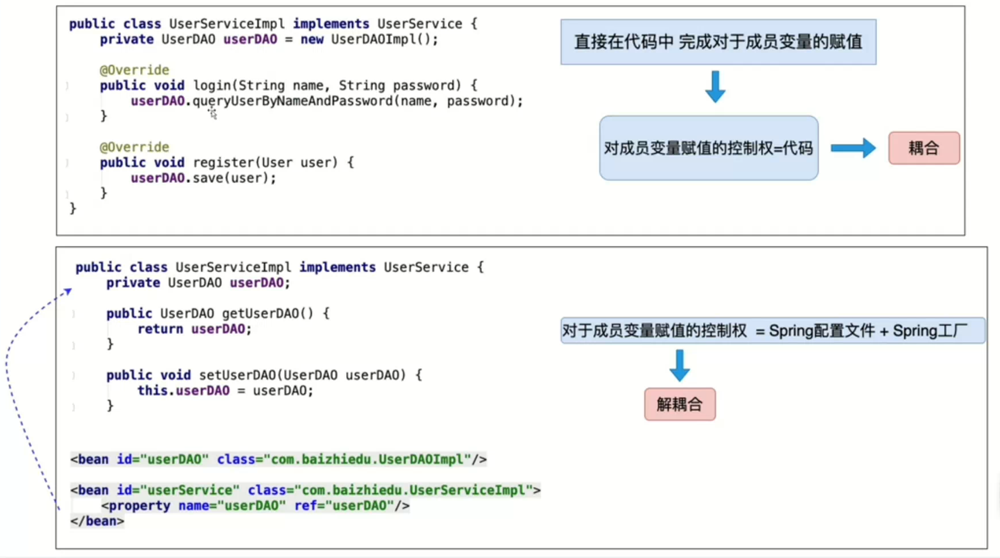

# spring

## 1. 工厂设计模式

```java
public interface UserService {
    void register(User user);

    void login(String username, String password);
}

public class UserServiceImpl implements UserService {

    private UserDao userDao = new UserDaoImpl();

    @Override
    public void register(User user) {
        userDao.save(user);
    }

    @Override
    public void login(String username, String password) {
        userDao.findByNameAndPassword(username, password);
    }
}
```

```java
public interface UserDao {
    void save(User user);

    void findByNameAndPassword(String name, String password);
}

public class UserDaoImpl implements UserDao {
    @Override
    public void save(User user) {
        System.out.println("insert into user = " + user);
    }

    @Override
    public void findByNameAndPassword(String name, String password) {
        System.out.println("select * from user where name = " + name + " and password = " + password);
    }
}
```

```java
public class User {
    private String name;
    private String password;

  	//...
}
```

```java
@Test
    public void test1() {
        UserService userService = new UserServiceImpl();
        // UserService userService = new NewUserServiceImpl();

        userService.register(new User("张三", "123456"));
        userService.login("张三", "123456");
    }
```

在这一版本代码中，测试类中`UserService userService = new UserServiceImpl();`存在代码耦合；在`private UserDao userDao = new UserDaoImpl();`存在代码耦合。


采用工厂类解决耦合：

```java
public static UserService getUserService() {
    return new UserServiceImpl();
} 
```

```java
@Test
public void test2() {
    // UserService userService = BeanFactory.getUserService();

    UserService userService = (UserService) BeanFactory.getBean("userService");

    userService.register(new User("张三", "123456"));
    userService.login("张三", "123456");
}
```

这样就解决了测试类中的耦合。但是工厂中又存在耦合了。


在resource根目录下新建`applicationContext.properties`文件，在工厂中读取配置文件，解决工厂中的字符串耦合。

```properties
userService=com.lb.basic.UserServiceImpl
userDao=com.lb.basic.UserDaoImpl
```

```java
private static Properties properties = new Properties();

    static {
        try {
     properties.load(BeanFactory.class.getClassLoader().getResourceAsStream("applicationContext.properties"));
        } catch (Exception e) {
            throw new RuntimeException(e);
        }
    }

public static UserService getUserService() {
    UserService userService = null;
    try {
        Class<?> aClass = Class.forName(properties.getProperty("userService"));
        userService = (UserService) aClass.newInstance();
    } catch (ClassNotFoundException | InstantiationException | IllegalAccessException e) {
        throw new RuntimeException(e);
    }
    return userService;
}

public static UserDao getUserDao() {
    UserDao userDao = null;
    try {
        Class<?> aClass = Class.forName(properties.getProperty("userDao"));
        userDao = (UserDao) aClass.newInstance();
    } catch (ClassNotFoundException | InstantiationException | IllegalAccessException e) {
        throw new RuntimeException(e);
    }
    return userDao;
} 
```

这样又发现重复代码太多，可以设计一个通用工厂：

```java
public static Object getBean(String beanName) {
    Object bean = null;
    try {
        Class<?> aClass = Class.forName(properties.getProperty(beanName));
        bean = aClass.newInstance();
    } catch (ClassNotFoundException | InstantiationException | IllegalAccessException e) {
        throw new RuntimeException(e);
    }
    return bean;
}
```

只是在使用时需要强转。


## 2. Spring核心API

### 2.1 ApplicationContext接口

```properties
ClassPathXmlApplicationContext   非web环境(main junit)

XmlWebApplicationContext	web环境
```


`ApplicationContext`是一个重量级资源，不会重复创建。一个应用只会创建一个工厂对象，并且它一定是线程安全的。


### 2.2 程序开发

1. 创建类型
2. 配置文件
3. 通过工厂类获取对象

```java
public class Person {
}

<bean id="person" class="com.lb.basic.Person"/>

@Test
public void test4() {
    ApplicationContext applicationContext = new ClassPathXmlApplicationContext("applicationContext.xml");
    Person person = applicationContext.getBean("person", Person.class);
    System.out.println("person = " + person);
}
```

### 2.3 Spring 工厂实现原理


## 3. 注入

什么是注入？通过Spring工厂及配置文件，为所创建的成员变量赋值。

为什么要注入？通过编码的方式为成员变量赋值，存在代码耦合。


### 3.1 如何进行注入？

1. 类的成员变量提供set get方法。

2. 配置Spring的配置文件。

   ```java
   <bean id="person2" name="p" class="com.lb.basic.Person">
       <property name="name" value="lb"/>
       <property name="id" value="18"/>
   </bean>
   ```

3. 注入的好处：解耦合。


### 3.2 注入的简易原理


Spring通过底层调用对象属性的set方法，完成对成员变量赋值。这种方式也称为set注入。


### 3.3 Set注入详解


### 3.4 构造注入


### 3.5 控制反转和依赖注入

什么是控制反转？

控制：对于成员变量赋值的控制权

反转控制：对于成员变量赋值的控制权，从代码中反转到Spring工厂和配置文件中完成。

底层实现：工厂设计模式



什么是依赖注入？

注入：通过Spring的工厂及其配置文件，为对象(bean, 组件)的成员变量赋值。

依赖注入：当一个类需要另外一个类时，就意味着依赖，一旦出现依赖，就可以把另一个类作为本类的成员变量，最终通过Spring的配置文件进行注入(赋值)。

好处：解耦合。


## 4. Spring创建复杂对象


### 4.1 Spring工厂创建复杂对象的三种方式

#### 4.1.1 FactoryBean接口


```xml
<bean id="connection" class="com.lb.factorybean.ConnectionFactoryBean"/>
```

如果class中指定的类型是FactoryBean接口的实现类，那么通过id值获取的是这个类所创建的复杂对象 Connection 。 


```java
public class ConnectionFactoryBean implements FactoryBean<Connection> {
    private String driverClassName;
    private String url;
    private String username;
    private String password;

    public String getDriverClassName() {
        return driverClassName;
    }

    public void setDriverClassName(String driverClassName) {
        this.driverClassName = driverClassName;
    }

    public String getUrl() {
        return url;
    }

    public void setUrl(String url) {
        this.url = url;
    }

    public String getUsername() {
        return username;
    }

    public void setUsername(String username) {
        this.username = username;
    }

    public String getPassword() {
        return password;
    }

    public void setPassword(String password) {
        this.password = password;
    }

    @Override
    public Connection getObject() throws Exception {
        Class.forName(driverClassName);
        return DriverManager.getConnection(url, username, password);
    }

    @Override
    public Class<?> getObjectType() {
        return Connection.class;
    }

    @Override
    public boolean isSingleton() {
        return false;
    }
}


<bean id="connection" class="com.lb.factorybean.ConnectionFactoryBean">
    <property name="driverClassName" value="com.mysql.cj.jdbc.Driver"/>
    <property name="url" value="jdbc:mysql://localhost:3306/mybatis_learn"/>
    <property name="username" value="root"/>
    <property name="password" value="mysql_1120"/>
</bean>
```


#### 4.1.2 FactoryBean实现的简易原理

接口回调

1. 为什么Spring规定FactoryBean接口，并且实现getObject()?
2. ctx.getBean("conn")获取的是复杂对象Connection，而非ConnectionFactoryBean。


Spring内部运行流程


### 4.2 实例工厂

### 4.3 静态工厂

### 4.4 总结


## 5. 对象生命周期

### 5.1 创建

`Spring`工厂什么时候创建对象？

- `scope = singleton`：`Spring`工厂创建的同时，创建对象。在这种情况下，如果需要在获取对象时再创建对象可以设置：`<bean lazy-init="true"`
- `scope = prototype`:在获取对象的同时创建对象。


### 5.2 初始化

 `Spring`在创建对象之后，调用对象的初始化方法，完成对象的初始化操作。

- `InitializingBean`接口

```java
@Override
public void afterPropertiesSet() throws Exception {
    根据自己的需求进行初始化
}
```

- 提供一个普通方法并在配置文件中配置。

```java
public void myInit() {
    
}

<bean id="product" class="xxx.Product" init-method=""/>
```

细节：

1. 如果二者同时存在：`InitializingBean` 先于 `myInit` 执行。

2. 注入先于初始化

### 5.3 销毁阶段

`Spring`什么时候销毁创建的对象？`applicationContext.close()`执行时。

- `DisposableBean`

  ```java
  @Override
  public void destroy() throws Exception {
      System.out.println("Product.destroy");
  }
  ```

- 提供一个普通方法并在配置文件中配置。

  ```java
  public void myDestroy() {
      System.out.println("Product.myDestroy");
  }
  <bean id="product" class="xxx.Product" destroy-method=""/>
  ```

  细节：

  1. 销毁操作仅仅适用于`scope="singleton"`


### 5.4 生命周期总结


### 5.5 后置处理Bean


程序员实现`BeanPostProcessor`规定接口中的方法：

```java
@Nullable
default Object postProcessBeforeInitialization(Object bean, String beanName) throws BeansException {
    return bean;
}
作用：Spring创建完对象并进行注入后可以运行before方法进行加工，
获得Spring创建好的对象：通过方法参数
最终通过返回值交给Spring框架
    

@Nullable
default Object postProcessAfterInitialization(Object bean, String beanName) throws BeansException {
	return bean;
}
作用：Spring执行初始化操作之后可以运行After方法加工
获得Spring创建好的对象：通过方法参数
最终通过返回值交给Spring框架
```

```java
public class Category {
    private Integer id;
    private String name;
	// set get
}

public class MyBeanPostPro implements BeanPostProcessor {

    @Override
    public Object postProcessBeforeInitialization(Object bean, String beanName) throws BeansException {
        return BeanPostProcessor.super.postProcessBeforeInitialization(bean, beanName);
    }

    @Override
    public Object postProcessAfterInitialization(Object bean, String beanName) throws BeansException {
        if (bean instanceof Category) {
            Category category = (Category) bean;
            category.setName("myBeanPostPro");
        }
        return bean;
    }
}

<bean id="category" class="com.lb.beanpost.Category">
    <property name="name" value="category"/>
    <property name="id" value="1"/>
</bean>

<bean id="myBeanPostPro" class="com.lb.beanpost.MyBeanPostPro"/>
```

